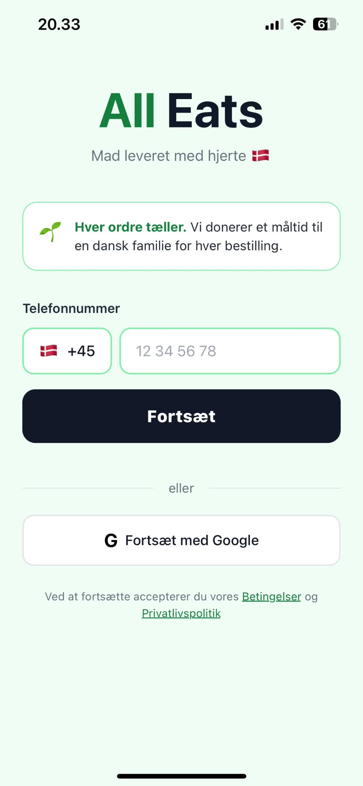
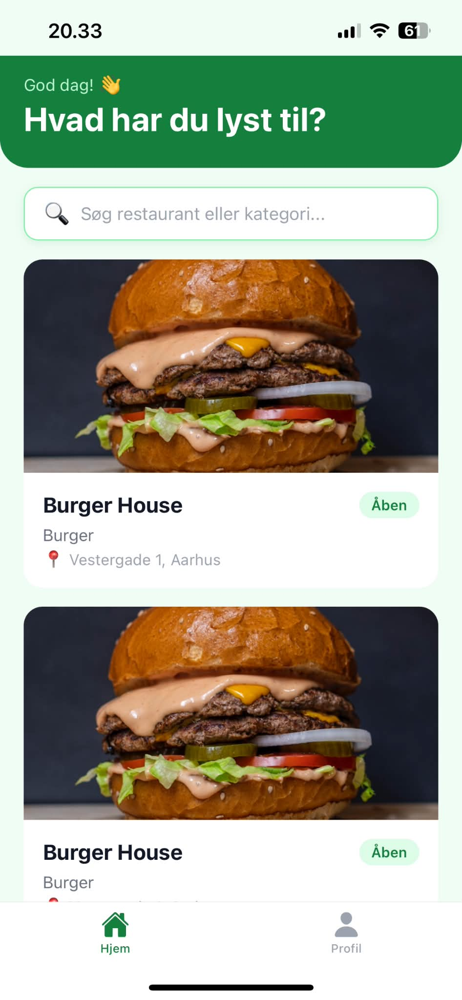
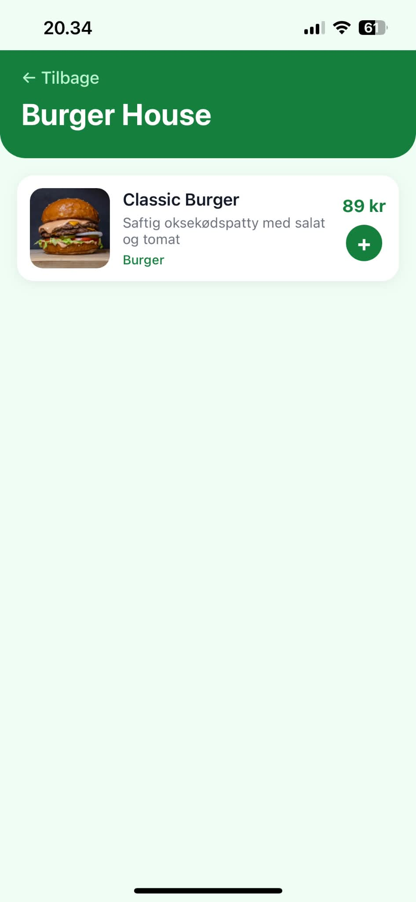
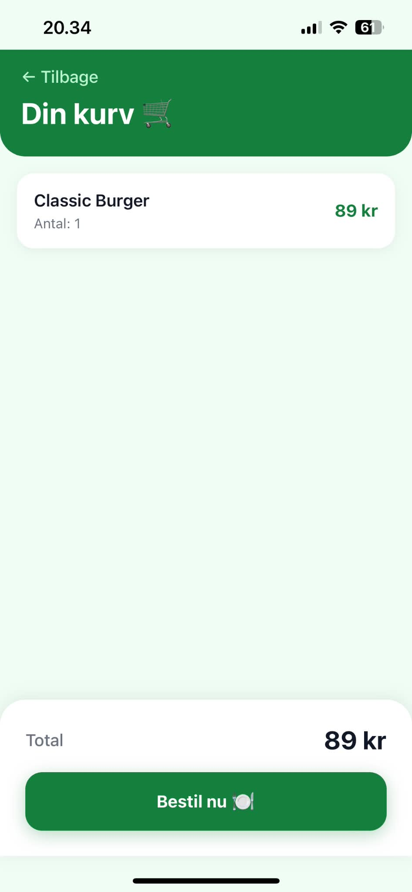
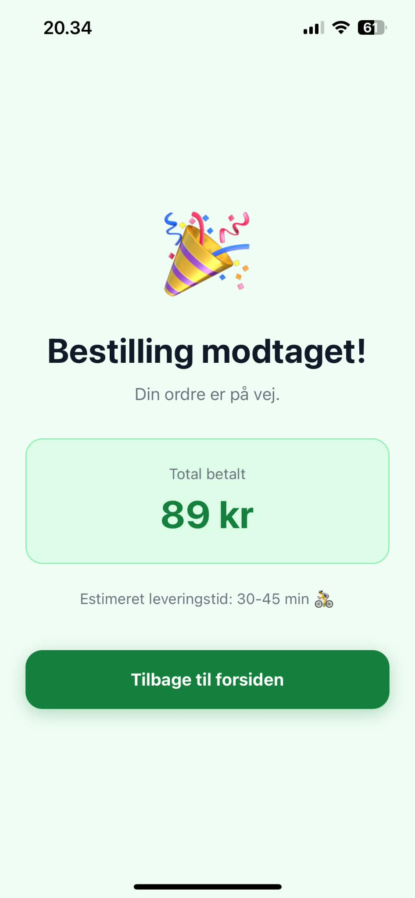
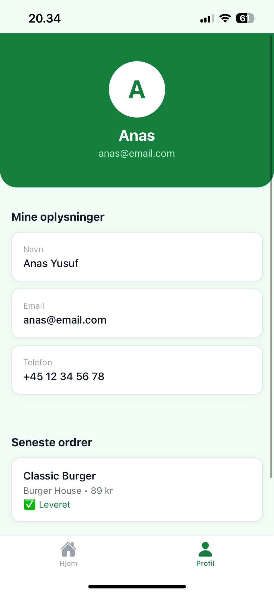

# AllEats 🌿
A food delivery app built from scratch — users can browse nearby restaurants and place orders from their phone.

## 📱 Screenshots

| Login | Restauranter | Menu |
|-------|-------------|------|
|  |  |  |

| Kurv | Orderconfirmation | Profil |
|------|------------------|--------|
|  |  |  |

## 🎥 Demo Video
*(Coming soon)*

## 🔗 Live Demo
[Visit AllEats](https://delivery-platform-cyan.vercel.app)

---

## ✨ Features
- ✅ Google login + telefonnummer login
- ✅ Splash screen med animation
- ✅ Restaurantliste med søgning
- ✅ Menubrowsing med billeder
- ✅ Kurv funktionalitet
- ✅ Ordrebekræftelse
- ✅ Brugerprofil

---

## 🛠 Stack
**Frontend** — React Native (Expo) + TypeScript
**Backend** — Spring Boot (Java) REST API
**Database** — MySQL
**Auth** — Google OAuth + JWT

---

## 📁 Project Structure
